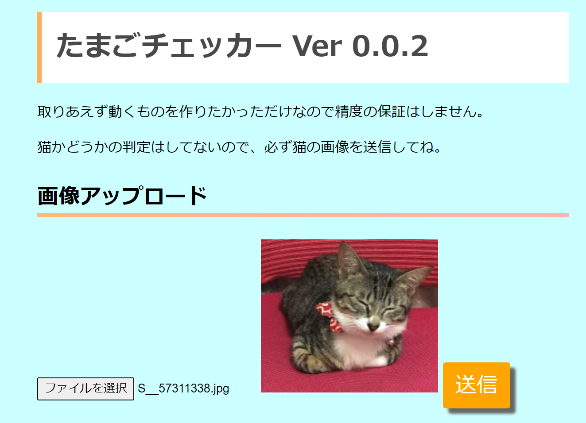
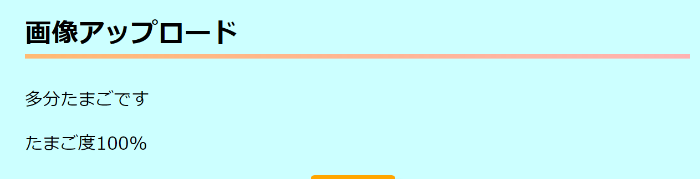

# Tamago-checker
 
私の飼っている猫の名前は「たまご」です。
このアプリケーションはWebブラウザから送信された猫の画像がたまごなのかそれ以外の猫なのかを判定します。

# DEMO

 

# Features
 
深層学習フレームワークKerasを使用しています。
Python + Flask + gunicornで動作しています。
 
# Installation
 
まずは推論のapiを動かします。

ドメイン名/api
にBase64で画像をPOSTすると推論の結果が返るようにします。

適当な場所にapp.pyとcnn_tamago.h5(学習済みモデル)を配置します。

gunicornをインストール

$pip3 install gunicorn

Apacheの設定

<VirtualHost *:80>

        ServerName your.domain.name.com

        ProxyPass /api http://127.0.0.1:8000/

        ProxyPassReverse /api http://127.0.0.1:8000/

</VirtualHost>  

gunicornを起動  

$gunicorn app:app --config gunicorn_config.py

この状態でドキュメントルートにhtmlフォルダの内容を放り込めば動作するはずです。

# Usage
 
ウェブブラウザからindex.phpにアクセスし、フォームから猫の画像を送信してください。
 
# Note
 
現時点では物体認識はしていないので、あくまでたまごかそれ以外の猫かの判定となります。
猫かどうかの判定はできません。

# Author
 
* Miya Abe
* Waseda Univ.
